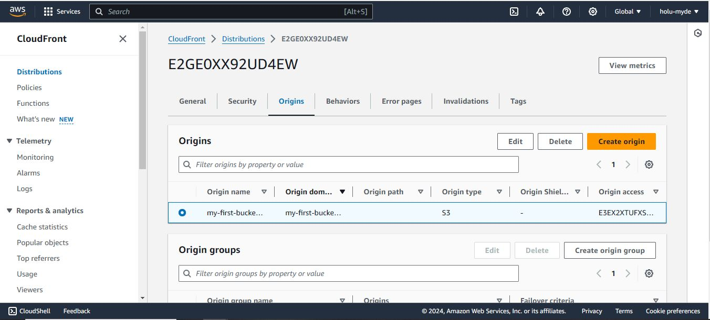

# Hosting-a-static-webpage-using-s3-bucket-and-AWS-cloud-front

### Important steps to follow are highlighted below (with screenshots)

1. Sign in to AWS either as a root user or a IAM user but be sure the user has the required permissions to access the needed services i.e. s3 buckets and Cloudfront

2. Within the AWS console, search for s3 and create your bucket (follow all necessary steps)

   

3. Upload objects/files into your newly created s3 bucket

   

   

4. Move objects from the primary folder into the s3 bucket root folder

   

5. Now, create Cloudfront distribution to serve s3 bucket content

   

6. Ensure that the Cloudfront origin is set to your s3 bucket name

   

7. Now, update your s3 bucket policy to allow Cloudfront access to the objects/files to be served

   

   

8. Now, copy your Cloudfront distribution domain name and paste in a browser to access the static webpage stored within the s3 bucket

   

Now, you can access your webpage content hosted within an AWS s3 bucket via Cloudfront.
